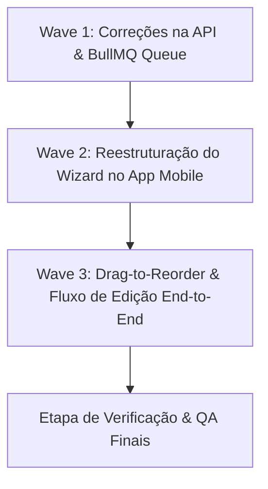

# PLAN.md — Planejamento de Execução: Milestone 3 (Sprint 3)
## Inventário: Cadastro de Sucatas & Veículos (Foco: M05)

Este documento apresenta o plano detalhado de auditoria, correções e implementação das tarefas da **Milestone 3 (Sprint 3)** para o módulo **M05 — Cadastro de Sucata / Veículo** da plataforma PECAÊ.

O plano foi elaborado após uma profunda análise técnica comparativa entre os requisitos de negócio definidos no arquivo [M05_cadastro_sucata.json](file:///c:/Users/italo/Desktop/Projects/pecae/docs-modules/M05_cadastro_sucata.json) e a atual base de código (NestJS API e App Mobile).

---

## 🔍 Relatório de Auditoria e Diagnóstico de Lacunas

### 1. Schema Prisma (`M05-T01`)
*   **Status de Conformidade:** 🟢 **100% Concluído e Correto**
*   **Análise Técnica:**
    *   Os modelos `Vehicle`, `VehiclePhoto` e `Listing` estão devidamente estruturados no arquivo `schema.prisma`.
    *   As regras de negócio **RN04** (Sem campos de preço) e **RN05** (Sem campos de chassi/VIN) foram rigorosamente respeitadas.
    *   O status inicial da entidade `Listing` está devidamente configurado como `PENDING` por padrão no banco de dados (**RN14**).
    *   Os índices compostos e de chave estrangeira (`@@index([sellerId, status])`, `@@index([city, state])` e `@@index([versionId])`) estão corretos para otimizar as futuras buscas complexas.

### 2. API NestJS (`M05-T03` e `M05-T04`)
*   **Status de Conformidade:** 🟡 **Parcialmente Concluído (Gaps Críticos Identificados)**
*   **O que está implementado corretamente:**
    *   Endpoints de criação (`POST /vehicles`), listagem (`GET /vehicles/me`), detalhe (`GET /vehicles/:id`) e exclusão física mapeados.
    *   Criação de `Vehicle` e `Listing` vinculada em transação atômica (`prisma.$transaction`) forçando o status `PENDING` (**RN14**).
    *   Detecção de placa duplicada e anúncio duplicado do mesmo vendedor (**RN10**) com injeção de warnings na resposta HTTP e preenchimento dos campos `isDuplicate` e `duplicateOfId`.
    *   Atualização rápida de peças disponíveis (`PATCH /vehicles/:id/parts`) atualizando apenas o vetor de componentes no veículo sem disparar re-moderação (exceção mandatória à **RN14**).
    *   Marcação como vendido (`markAsSold`) alterando status para `SOLD` com timestamp `soldAt` (**RN06**).
*   **Gaps Identificados (Ações Necessárias):**
    *   **Upload e Processamento de Fotos via BullMQ:** Embora a geração de presigned URLs esteja mapeada e a rota `/confirm` de fotos exista, a API NestJS atual **não realiza** o processamento assíncrono de fotos (resize com `sharp`, geração de thumbnails e re-upload para bucket público) por meio de jobs do BullMQ. O `confirmPhotos` grava os registros de imagem instantaneamente com as URLs brutas.
    *   **Divergência de Verbo de Atualização:** O mobile está estruturado para disparar `PATCH /vehicles/:id` para a edição de metadados, enquanto o controller do backend aceita apenas `PUT /vehicles/:id`. Isso causará erro de barramento HTTP (404/405) no fluxo de edição do app.

### 3. App Mobile (`M05-T02`)
*   **Status de Conformidade:** 🔴 **Gaps Estruturais Graves**
*   **O que está implementado corretamente:**
    *   A store global do Zustand (`vehicle-wizard-store.ts`) possui a estrutura correta de dados para gerenciar o wizard e ações de transição de passos (`nextStep`, `prevStep`), bem como carga de dados para edição (`loadVehicle`).
    *   Os componentes visuais isolados de cada etapa (`Step1VehicleSelection`, `Step2TechDetails`, `Step3Photos`, `Step4Inventory`, `Step5Review`) já estão parcialmente codificados na pasta de componentes `VehicleWizard`.
*   **Gaps Identificados (Ações Necessárias):**
    *   **Inexistência do Wizard Multi-step:** O app não conecta esses componentes de steps a nenhuma rota. A tela atual de cadastro (`cadastrar-sucata.tsx`) é um formulário único e longo.
    *   **Bug Crítico de Edição no Formulário Atual:** A tela `cadastrar-sucata.tsx` sempre dispara chamadas para `api.post('/vehicles')` (Criação), o que significa que se o vendedor clicar em "EDITAR" no seu inventário, o app criará um veículo duplicado em vez de atualizar o registro existente.
    *   **Divergência de Validação de Imagens:** O mobile valida o mínimo de 3 fotos e máximo de 12 fotos, enquanto o requisito **M05** e o ROADMAP determinam estritamente o **mínimo de 4 fotos e máximo de 10 fotos**.
    *   **Ausência de Reordenação Dinâmica (Drag-and-Drop):** O `Step3Photos` renderiza as fotos em um flex wrap estático, sem permitir o drag-to-reorder exigido em `M05-T02-ST03` para reorganizar a galeria técnica.

---

## ⚡ Plano de Execução Separado em Waves

Para resolver todos os gaps identificados sem introduzir regressões ou complexidade desnecessária, o plano é dividido em **3 Waves consecutivas**.

---

### 🌊 Wave 1: Alinhamento de APIs e Processamento Assíncrono de Imagens (Backend)
**Foco:** Garantir que o backend processe as fotos do veículo assincronamente através de filas e aceite as rotas corretas vindas do app mobile.

*   **[ ] M03-W1-T01: Registro da Fila de Fotos no `VehiclesModule`**
    *   *Descrição:* Registrar a fila `vehicle-photos` no modulo NestJS usando `@nestjs/bullmq`.
    *   *Arquivos:* [vehicles.module.ts](file:///c:/Users/italo/Desktop/Projects/pecae/apps/api/src/vehicles/vehicles.module.ts)
    *   *Critérios de Aceitação:* O módulo expõe a fila do BullMQ corretamente conectada ao Redis da plataforma.

*   **[ ] M03-W1-T02: Criação do Processor/Worker `VehiclePhotosProcessor`**
    *   *Descrição:* Desenvolver o worker BullMQ que escuta a fila de fotos de veículo, faz o download do arquivo bruto no bucket temporário, redimensiona usando a biblioteca `sharp` para um tamanho padrão otimizado (largura máxima de 1200px) e gera um thumbnail de visualização rápida (400x300px), fazendo o upload de volta ao Supabase Storage e marcando o status da imagem como pronto.
    *   *Arquivos:* Criar `vehicle-photos.processor.ts` dentro de `apps/api/src/vehicles/processors/` ou pasta equivalente.
    *   *Critérios de Aceitação:* Imagens são processadas assincronamente e os tamanhos dos arquivos no bucket são reduzidos de forma drástica, preservando a qualidade da galeria.

*   **[ ] M03-W1-T03: Ajuste de Ownership e Verbos no Controller**
    *   *Descrição:* Suportar no `VehiclesController` o verbo `PATCH :id` para a atualização do veículo (para total compatibilidade com o código atual de steps do mobile) ou padronizar a edição na API e documentá-la no Swagger.
    *   *Arquivos:* [vehicles.controller.ts](file:///c:/Users/italo/Desktop/Projects/pecae/apps/api/src/vehicles/vehicles.controller.ts)

---

### 🌊 Wave 2: Ativação e Reestruturação do Wizard Multi-step no Mobile
**Foco:** Mudar a UX do app mobile de um formulário único e extenso para o Wizard de 5 passos com Zustand, utilizando os componentes pré-existentes.

*   **[ ] M03-W2-T01: Refatoração da Rota de Cadastro de Sucata**
    *   *Descrição:* Atualizar o arquivo `cadastrar-sucata.tsx` para atuar como o container principal do wizard. O formulário único longo será removido. Em seu lugar, a tela renderizará dinamicamente o componente do passo correspondente (`Step1`, `Step2`, etc.) baseado no `currentStep` obtido da `useVehicleWizardStore`.
    *   *Arquivos:* [cadastrar-sucata.tsx](file:///c:/Users/italo/Desktop/Projects/pecae/apps/mobile/app/(seller)/cadastrar-sucata.tsx)
    *   *Design System:* Manter a estética de "Forja Digital" utilizando `PecaeBackground`, `PecaeGlassCard`, barra de progresso horizontal neon âmbar no topo, e animações de transição suaves.

*   **[ ] M03-W2-T02: Alinhamento das Regras de Fotos na Store Zustand**
    *   *Descrição:* Atualizar a validação e limites de fotos no `vehicle-wizard-store.ts` para exigir estritamente de **4 a 10 fotos** (**M05**) em vez dos limites antigos de 3 a 12.
    *   *Arquivos:* [vehicle-wizard-store.ts](file:///c:/Users/italo/Desktop/Projects/pecae/apps/mobile/src/store/vehicle-wizard-store.ts)
    *   *Critérios de Aceitação:* O botão "Avançar" no Step 3 de fotos só fica ativo se o usuário carregar pelo menos 4 fotos, e fica desabilitado para adicionar novos arquivos caso atinja o limite máximo de 10.

*   **[ ] M03-W2-T03: Correção de Estilo e Integração dos Steps**
    *   *Descrição:* Integrar e ajustar os estilos dos componentes de steps individuais para garantir que herdem corretamente o tema customizado do PECAÊ e usem as chamadas à API de catálogo existentes.
    *   *Arquivos:* [Step1VehicleSelection.tsx](file:///c:/Users/italo/Desktop/Projects/pecae/apps/mobile/src/components/VehicleWizard/Step1VehicleSelection.tsx), [Step2TechDetails.tsx](file:///c:/Users/italo/Desktop/Projects/pecae/apps/mobile/src/components/VehicleWizard/Step2TechDetails.tsx), [Step4Inventory.tsx](file:///c:/Users/italo/Desktop/Projects/pecae/apps/mobile/src/components/VehicleWizard/Step4Inventory.tsx).

---

### 🌊 Wave 3: Galeria Técnica Otimizada e Fluxo de Edição Seguro
**Foco:** Habilitar a reordenação das fotos na galeria e certificar que a edição atualize o veículo em vez de duplicá-lo no banco.

*   **[ ] M03-W3-T01: Ajuste de Ordem e Reordenação Visual das Fotos**
    *   *Descrição:* Ajustar o `Step3Photos.tsx` para exibir claramente o número de ordem de cada foto e permitir a sua reorganização de forma simplificada e estável no Expo. Incluir um botão explícito para mover imagens ou usar um grid dinâmico amigável.
    *   *Arquivos:* [Step3Photos.tsx](file:///c:/Users/italo/Desktop/Projects/pecae/apps/mobile/src/components/VehicleWizard/Step3Photos.tsx)
    *   *Critérios de Aceitação:* A imagem de capa (ordem 0) exibe uma estrela dourada proeminente e a marcação "CAPA". O vendedor pode alterar a ordem das imagens com facilidade.

*   **[ ] M03-W3-T02: Correção do Fluxo de Edição em `Step5Review`**
    *   *Descrição:* Corrigir a chamada de finalização em `Step5Review.tsx` para assegurar que se o vendedor estiver editando um veículo (`editingId` presente), o app envie a requisição para a rota correta do NestJS com o verbo HTTP alinhado, garantindo a atualização perfeita e a re-moderação mandatória (**RN14**).
    *   *Arquivos:* [Step5Review.tsx](file:///c:/Users/italo/Desktop/Projects/pecae/apps/mobile/src/components/VehicleWizard/Step5Review.tsx)
    *   *Critérios de Aceitação:* Veículo é atualizado com sucesso sem criar novos registros indesejados. O anúncio volta ao status de moderação `PENDING` na API.

---

## 🧪 Plano de Verificação e QA

### Testes Automatizados (Backend)
*   **Testes Unitários de Serviço:** Executar `npm run test` no escopo do `vehicles.service.spec.ts` para verificar o isolamento das regras de criação e atualização.
*   **Testes de Validação DTO:** Testar com payloads de criação de lote contendo os campos proibidos (`price`, `chassi`) para garantir que o interceptor de validação do NestJS rejeite as requisições com código 400 Bad Request.

### Verificação Manual (Mobile e E2E)
1.  **Fluxo de Criação de Lote:**
    *   Iniciar o app mobile como vendedor, ir ao Inventário e tocar em cadastrar.
    *   Passar pelo Step 1 (selecionar veículo catalogado) e Step 2 (especificações técnicas).
    *   Tentar avançar com menos de 4 fotos (deve ser bloqueado). Adicionar 4 fotos e definir a foto 3 como capa (deve refletir no preview final).
    *   Selecionar peças disponíveis, revisar no Step 5 e confirmar.
    *   Verificar no banco Prisma Studio se o `Vehicle` foi criado como `PENDING` e a `Listing` foi criada como `PENDING` (confirmando a **RN14**).
2.  **Fluxo de Edição de Lote:**
    *   No inventário do vendedor, tocar em "Editar" em uma sucata existente.
    *   O wizard deve abrir pré-preenchido com todas as informações originais.
    *   Alterar a cor do lote e avançar até o fim, confirmando a edição.
    *   Verificar que nenhuma nova sucata foi criada no banco de dados e que o status do anúncio existente voltou para `PENDING` para re-moderação.
3.  **Fluxo de Atualização Rápida de Peças:**
    *   Alterar as peças disponíveis a partir do card rápido de inventário.
    *   Validar que os dados no banco foram atualizados instantaneamente e que o status do anúncio permaneceu inalterado (pulando a moderação).
